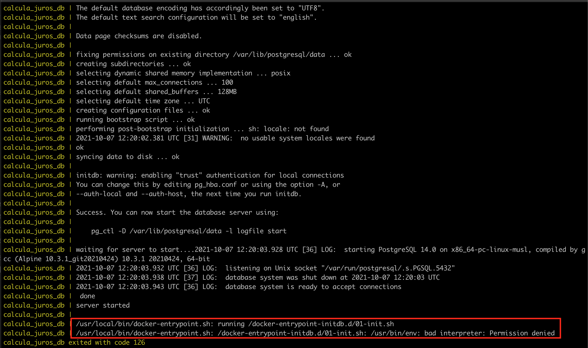

# :money_with_wings: Calcula Juros

Aplicação responsável por calcular o juros em cima de um produto, com base na taxa Selic.

Todo o desenvolvimento foi feito utilizando a IDE [IntelliJ](https://www.jetbrains.com/pt-br/idea/)
<br/>
A versão do Java é [AdoptOpenJDK 11.0.11](https://adoptopenjdk.net/) 

----

### Ambiente
#### Instalação:
- Ubuntu / macOS
  - [SDKMAN - Para controle de versão do Java](https://sdkman.io/install);
  - [Docker Compose](https://docs.docker.com/compose/install/)

- Ubuntu 
  - [Docker](https://docs.docker.com/engine/install/ubuntu/)
  - Maven
    ```bash
    $ sudo apt update
    $ sudo apt install maven
    ```

- macOS
    - [Brew - Gerenciador de pacotes](https://brew.sh/index_pt-br)
    - [Docker](https://docs.docker.com/docker-for-mac/install/)
    - Maven:
    ```bash
    $ brew install maven
    ```
#### Executar os seguintes comandos de instalação no terminal:
```bash
$ sdk install java 11.0.11.hs-adpt
$ sdk default java 11.0.11.hs-adpt
```
>Instalação versão padrão do java

<br/>

```bash
$ docker run --name postgres_cntr -p 5432:5432 -e POSTGRES_PASSWORD=admin -d postgres  
$ docker start postgres_cntr
```
>Criação de container para banco de dados

<br/>

```bash
$ docker rm postger_cntr
```
>Para remover o container criado, basta executar o seguinte comando

<br/>

----

### Execução da aplicação:
#### Ambiente local
```bash
calcula-juros$ docker start postgres_cntr
calcula-juros$ docker cp ./create.sql postgres_cntr:/create.sql
calcula-juros$ docker exec -it postgres_cntr psql -U postgres -f /create.sql
calcula-juros$ ./mvnw clean install
calcula-juros$ ./mvnw spring-boot:run
```
>Rode o comando para subir o container do banco de dados, caso não esteja a executar, coloca o arquivo `create.sql` com a criação do schema da database dentro do container, depois executa este script no container, instala as dependências do projeto e em seguida execute o comando para iniciar a aplicação

<br/>

#### Ambiente com Docker
#### Geração
```bash
calcula-juros$ ./mvnw clean package -DskipTests
calcula-juros$ cp target/calcula-juros-0.0.1-SNAPSHOT.jar src/main/docker
```
> Primeiro comando gera um novo jar da aplicação e o segundo coloca esse jar na pasta do docker.

<br/>

#### Subir container
```bash
calcula-juros$ cd src/main/docker
calcula-juros/src/main/docker$ docker-compose up
# ou para rodar o serviço de fundo no SO
calcula-juros/src/main/docker$ docker-compose up -d
```
> Entra no diretório correto e executa o primeiro comando para gerar um novo container e executa um dos 2 últimos comandos para subir a aplicação

<br/>

#### Erro de permissão ao executar container


Caso ocorra esse erro descrito na execução via docker-compose, é necessário executar os seguintes comandos:
```bash
calcula-juros/src/main/docker$ chmod +r db/01-init.sh
calcula-juros/src/main/docker$ chmod +x db/01-init.sh
```
> Dando permissão de execução e leitura para o arquivo

<br/>

----

### Execução dos testes da aplicação:
#### Comandos
```bash
calcula-juros$ ./mvnw test -Dtest=TestingWebApplicationTest
```
>Executa testes do endpoint /negociacao

<br/>

----

### Teste de endpoints com Insomnia
### [Arquivo .json](https://github.com/douglas-martins/calcula-juros/blob/main/Insomnia_Calcula_Juros.json)
> Se encontra na raiz do projeto com nome _Insomnia_Calcula_Juros.json_

<br/>

----

### Documentação API
Para visualização de todos os endpoints disponíveis da aplicação, basta acessar em seu navegador (com a aplicação de pé):

`http://localhost:8080/swagger-ui/index.html`
>Foi utilizado o [Swagger 2](https://swagger.io/specification/v2/)

<br/>

----

### Bonus ([Lazydocker](https://github.com/jesseduffield/lazydocker))
Uma interface de terminal simples para docker e docker-compose, escrita em Go com a biblioteca [gocui](https://github.com/jroimartin/gocui 'gocui').
### Instalação

##### Binary Release (Linux/OSX/Windows)

Você pode baixar manualmente uma versão binária [da página de versão](https://github.com/jesseduffield/lazydocker/releases).

Instalação / atualização automática

```sh
$ curl https://raw.githubusercontent.com/jesseduffield/lazydocker/master/scripts/install_update_linux.sh | bash
```

O script instala o binário baixado no diretório `/usr/local/bin` por padrão, mas pode ser alterado configurando a variável de ambiente` DIR`.
